# Altynx | Energy & Manufacturing
### Industrial IoT and Smart Automation Ecosystem

---

  &nbsp;   &nbsp;  

```mermaid
graph LR
    %% Advanced CSS Styling for Smoothness and Color
    classDef userGateway fill:#0f172a,stroke:#38bdf8,stroke-width:2px,color:#fff,rx:20,ry:20;
    classDef coreApp fill:#1e1b4b,stroke:#818cf8,stroke-width:2px,color:#fff,rx:20,ry:20;
    classDef aiEngine fill:#4c0519,stroke:#f43f5e,stroke-width:2px,color:#fff,rx:20,ry:20;
    classDef cloudInfra fill:#064e3b,stroke:#34d399,stroke-width:2px,color:#fff,rx:20,ry:20;
    classDef dataLayer fill:#422006,stroke:#fb923c,stroke-width:2px,color:#fff,rx:20,ry:20;
    
    %% Link Styling (Sleek grey paths)
    linkStyle default stroke:#64748b,stroke-width:2px,fill:none;

    %% Free-floating Nodes with Industrial Icons
    Plant(["fa:fa-industry Plant Manager Portal"]):::userGateway
    Field(["fa:fa-helmet-safety Field Engineer App"]):::userGateway
    API(["fa:fa-network-wired IIoT API Gateway"]):::userGateway
    
    SCADA(["fa:fa-bolt SCADA Control System"]):::coreApp
    PLM(["fa:fa-gears PLM Microservices"]):::coreApp
    
    Predict(["fa:fa-screwdriver-wrench Predictive Maintenance"]):::aiEngine
    Anomaly(["fa:fa-wave-square AI Anomaly Detection"]):::aiEngine
    
    Edge(["fa:fa-server Industrial Edge Nodes"]):::cloudInfra
    Cloud(["fa:fa-cloud Resilient Grid Cloud"]):::cloudInfra
    
    CRM(["fa:fa-users-gear Asset Lifecycle CRM"]):::dataLayer
    Data(["fa:fa-database Unified Telemetry Data"]):::dataLayer

    %% Flow Path Connections
    Plant == "Monitor" ==> API
    Field == "OT Access" ==> API
    API -. "Secure OT/IT" .-> PLM
    API ==> SCADA
    SCADA ==> Predict
    Predict -. "Sensor Streams" .-> Anomaly
    SCADA ==> Edge
    Edge ==> Cloud
    Cloud ==> CRM
    Anomaly ==> Data
    CRM ==> Data
```

This repository serves as a mission-critical engineering showcase by **Altynx**. It demonstrates a unified approach to modern Industrial technology, focusing on operational automation, predictive maintenance, and energy efficiency orchestration.

---

### 1. Custom Software Engineering
**Industrial Control & Monitoring Systems**

   

Engineering high-reliability software for SCADA systems and Product Lifecycle Management (PLM), designed for heavy industrial environments and real-time data processing.

### 2. AI and Neural Frameworks
**Predictive Maintenance & Grid Intelligence**

   

Developing AI models for early fault detection and energy grid optimization using proprietary neural architectures and RAG-enhanced diagnostic pipelines.

### 3. Cloud and Infrastructure Engineering
**Edge Computing & Grid Resilience**

   

Orchestrating scalable IoT data streams and edge computing infrastructure to ensure low-latency monitoring and grid stability across industrial sites.

### 4. DevOps and Automation Excellence
**Secure OT/IT Integration**

   

Ensuring manufacturing floors and energy grids stay operational with zero-downtime deployment pipelines and automated security protocols for mission-critical OT systems.

### 5. Web and Mobile App Engineering
**Operational Insight Dashboards**

   

Developing high-velocity dashboards for plant managers and mobile apps for field engineers to monitor asset performance and energy consumption in real-time.

### 6. CRM and Data Intelligence
**Asset Lifecycle Intelligence**

  

Centralizing industrial asset performance and maintenance logs into custom CRM integrations for intelligence-driven decision making and lifecycle management.

### 7. Elite Staff Augmentation
**Specialized Industrial Squads**

  

Deploying dedicated engineering squads to accelerate industrial automation roadmaps and large-scale manufacturing migrations through professional squad deployment.

---

### Legal and Intellectual Property
Copyright © 2026 **Altynx**. All rights reserved. 

The architecture, code patterns, and methodologies contained within this repository are the exclusive proprietary property of Altynx. Unauthorized reproduction is prohibited.

---
### Contact Information
Inquiries: [info@altynx.com](mailto:info@altynx.com)  
Official Website: [altynx.com](https://altynx.com)
